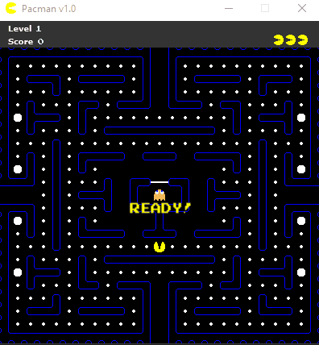
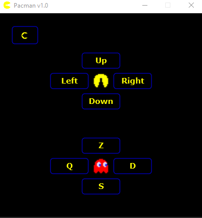
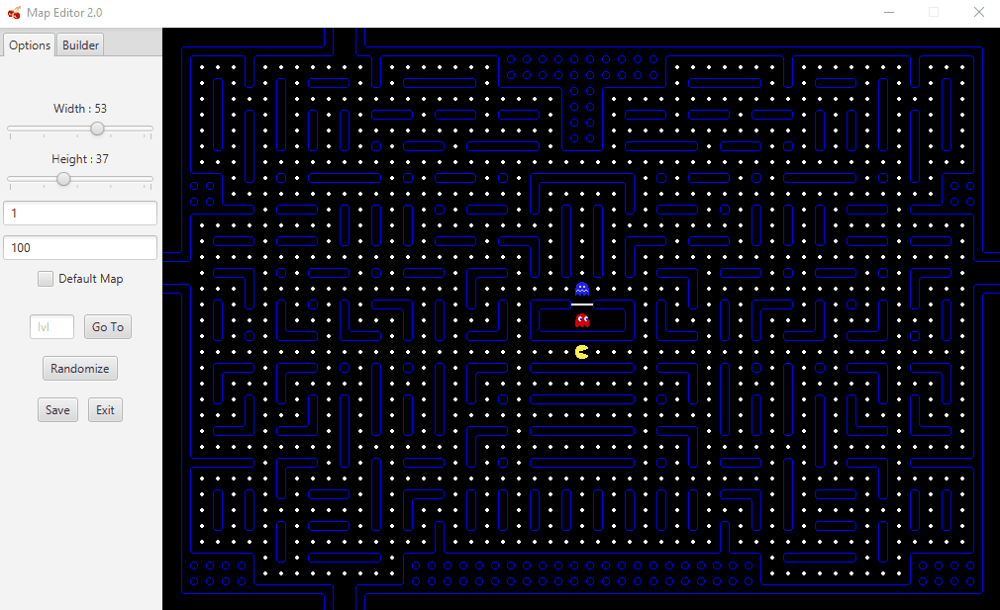

# Projet Pacman

The goal of the project was to recreate a working game of Pacman using the Observer Design Pattern and a Multithreaded architecture

The project features : 
* The base Game fully animated with original Ghosts AI     
* A working Sound Engine
* Fully customizable Controls

* 2 Players mode, the second player controls Blinky (the red ghost)
* Leaderboard with name and highscore saved
* A complete Map Editor featuring
  - Multi-level map assignement
  - Customizable map size independant between levels
  - Random maze generator (with no dead-end and warp-around gates)

### Prerequisites

The project needs JavaFX 14 to compile

### Installing

Import the sources into a project, add the JavaFX 14 library then set the main class to controller/view/ViewController.java

### Running

If the Livrable/Pacman.jar file doesn't start, use the following command 

`java -jar Pacman.jar`

If you use Java 13 or higher, the JavaFX runtime isn't loaded by default, you can fix this by adding the following JVM Argument

`-p lib/ --add-modules javafx.fxml,javafx.controls`

## Built With

* [JavaFX 14](https://openjfx.io/)

## Authors

* **[Alban LACAILLE](https://github.com/alban098)**
* **Louis Peizerat**

## License

This project is licensed under the **[MIT license](http://opensource.org/licenses/mit-license.php)**
